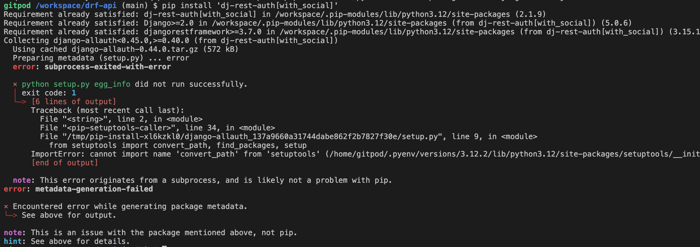

# Testing

## Python validation

I have tested all the .py files in every app in Code Institutes [CI Python Linter](https://pep8ci.herokuapp.com).
All files has been validation with a valid result:

## Manual Testing

| # | Endpoint | Method | Expected outcome | Pass/Fail |
| -- | --- | --- | --- | --- |
| | **Comments** | | | |
| 1 | /comments | GET | A list of all comments | ✅ |
| 2 | /comments | POST | Create a new comment | ✅ |
| 3 | /comments/:id | GET | A listing with its details | ✅ |
| 4 | /comments/:id | PUT | Update listing's details | ✅ |
| 5 | /comments/:id | DELETE | Delete a listing | ✅ |
| | **Contacts** | | | |
| 6 | /contacts | GET | A list of contacts made | ✅ |
| 7 | /contacts/:id | GET | A detailed listing of contacts | ✅ |
| 8 | /contact/ | POST | Create a new contact | ✅ |
| | **Followers** | | | |
| 9 | /followers | GET | A list of all followers | ✅ |
| 10 | /followers | POST | Follow a user | ✅ |
| 11 | /followers/:id | GET | A detailed listing of a follower | ✅ |
| 12 | /followers/:id | DELETE | Unfollow a user | ✅ |
| | **Likes** | | | |
| 13 | /likes | GET | A list of all likes | ✅ |
| 14 | /likes | POST | Like a post | ✅ |
| 15 | /likes/:id | GET | A detailed listing of a like | ✅ |
| 16 | /likes/:id | DELETE | Unlike a post | ✅ |
| | **Posts** | | | |
| 17 | /posts | GET | A list of all posts | ✅ |
| 18 | /posts | POST | Create a new post | ✅ |
| 19 | /posts/:id | GET | A detailed listing of a post | ✅ |
| 20 | /posts/:id | PUT | Update a post's details | ✅ |
| 21 | /posts/:id | DELETE | Delete a post | ✅ |
| | **Profiles** | | | |
| 22 | /profiles | GET | A list of all profiles | ✅ |
| 23 | /profiles/:id | GET | A detailed listing of a profile | ✅ |
| 24 | /profiles/:id | PUT | Update a profile's details | ✅ |
| | **Tags** | | | |
| 25 | /tags | GET | A list of all tags | ✅ |
| 26 | /tags | POST | Create a new tag | ✅ |
| 27 | /tags/:id | GET | A detailed listing of a tag | ✅ |
| 28 | /tags/:id | PUT | Update a tag's details | ✅ |
| 29 | /tags/:id | DELETE | Delete a tag | ✅ |

## BUGS

I got this error while trying to install 'dj-rest-auth[with_social]:

Solution: I had to downgrade python by running pyenv install 3.9.18 && pyenv global 3.9.18 in the terminal.
After that, i reinstalled the packages with: pip install -r requirements.txt.

Unsolved bugs: None
